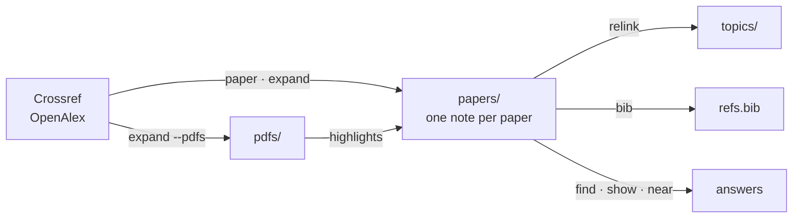

# research-assistant

Reference management for an Obsidian vault: Crossref/OpenAlex → one Markdown
note per paper → BibTeX.



**The only bytes a model writes into a note are the `### ` headings over your
highlight groups.** Everything else is a pure function of the two public indexes
and what is already on disk, so re-running a command is idempotent and two people
running it get the same vault. No abstract is summarised, no quote paraphrased,
no field invented. Where a model does decide something, it decides which quotes
belong together and what to call the group, never a word of the quotes
themselves.

The notes are the source of truth; the BibTeX file is generated from them. The
note format, not the Python, is the public API. It is specified in
[`docs/note-format.md`](docs/note-format.md), and that is what the version
number is a promise about.

## Install

Install both: the plugin drives the CLI.

**The CLI:**

```bash
uv tool install git+https://github.com/namitdeb739/research-assistant
```

**The Claude Code plugin:**

```text
/plugin marketplace add namitdeb739/research-assistant
/plugin install research-assistant
```

Inside a uv project that depends on it, the command is `uv run
research-assistant`.

Half of this is knowledge, not code: when to search rather than read, how to
group quotes without touching their text, what the notes deliberately do not
record. The plugin ships from this same repo, versioned by the same tag, so its
skills never describe a CLI you do not have. It adds:

| | |
|---|---|
| Skills | `research-vault`, `highlights` |
| Command | `/lit <topic>`: prior art, filtered against what you already have |
| Hook | Warn-only `PreToolUse`: nudges a `Read` or `grep` of the papers folder toward `find` and `show`. Silent unless `VAULT_PAPERS_DIR` is set. |

## Configuration

| Variable | Flag | Meaning |
|---|---|---|
| `VAULT_PAPERS_DIR` | `--papers-dir` | The vault folder holding one note per paper. **No default**, because guessing at someone's folder layout is worse than saying so. |
| `RESEARCH_ASSISTANT_USER_AGENT` | — | Your contact address for the Crossref and OpenAlex polite pools, e.g. `myproject/1.0 (mailto:you@example.com)`. Unset means the anonymous pool: slower, but works. |

## Commands

### Read (never writes)

| Command | Does | Notable flags |
|---|---|---|
| `find <query…>` | Ranked search, best match first | `--topic` `--tag` `--venue` `--min-year` `--max-year` `--min-citations` `--has-pdf`/`--no-pdf` `--limit` `--full` `--json` |
| `show <target…>` | Whole notes, by cite key, note name or DOI | |
| `near <target>` | What it cites, and what in the vault cites it | |
| `pdf <key>` | The note↔PDF join, both directions | `--note <file>` `--audit` |
| `cite-check <file.tex…>` | Reconcile a document's `\cite` keys against the vault | `--bib` `--unused`/`--no-unused` |

Ranking is BM25 over title (×3), topics (×2), and abstract, notes, venue and
authors (×1). No index, no embeddings. Terms are OR-ed and there is no stemmer,
so `backscatter` does not match `backscattering`. With filters but no
query, `find` lists the filtered set by citation count.

`pdf` prints one absolute path on stdout and nothing else, so it pipes straight
into a reader. `pdf --audit` reconciles what the notes claim against what is on
disk. Run it before making any coverage claim.

`cite-check` is the one command that looks at what you are actually writing. It
pulls the keys out of a `.tex` file (every `\cite` variant, optional arguments
and comma lists included) and diffs them against the vault. A key with no note
behind it is an unresolvable citation, so it exits non-zero; notes cited nowhere
are only reported, because a vault is meant to be larger than any one paper.

```bash
research-assistant cite-check thesis.tex chapters/*.tex
research-assistant cite-check --bib refs.bib     # keys defined, not cited
```

### Write

| Command | Does | Notable flags |
|---|---|---|
| `paper <doi\|openalex-id>` | Look one up and add it | `--force` |
| `source` | Record what no index knows | `--title` `--author` `--year` `--venue` `--url` `--type` `--pdf` `--key` |
| `expand` | Walk the citation graph one hop | `--dry-run` `--screen` `--report` `--adopt` `--include` `--exclude` `--reason` `--backward` `--forward` `--related` `--pdfs` `--min-year` `--limit` |
| `relink` | Rebuild `cites` links and topic hubs | |
| `tidy` | Reformat bodies, adopt PDFs, fill abstracts, restore key order | `--abstracts`/`--no-abstracts` `--bibfields` |
| `bib --out <file>` | Regenerate the bibliography | `--check` |

Why they behave as they do:

- **`paper` takes a DOI *or* an OpenAlex id,** because a DOI is not universal:
  USENIX mints none. A DOI goes to Crossref first, authoritative for the fields
  a bibliography needs; an OpenAlex id falls back to that index alone.
  Deduplication checks both keys.
- **`source` is the escape hatch below both indexes**, with no lookup at all. The
  indexes cover journals and proceedings; a bibliography cites a slide deck, a
  vendor guide, a datasheet, a standard. Such a note carries `doi: null` and
  `openalex_id: null`, so the citation graph cannot reach it. Link it by hand.
- **`expand` walks out from every note *not* tagged `harvested`,** so re-running
  it never quietly reaches depth 2. Drop that tag from the paper worth going
  deeper on.
- **`expand` remembers what you turned down.** Decisions go in a sibling
  `screening.tsv`, not in frontmatter: an exclusion is a fact about your search
  process, not about the paper, and an excluded paper has no note to hold it
  anyway. A note that exists always beats the ledger, and `--report` prints the
  four PRISMA numbers plus wherever the two disagree. See
  [`docs/screening.md`](docs/screening.md).
- **`relink` writes links, not labels.** A plain string groups a table fine but
  is not a node. A topic earns a hub only once several papers share it.
- **`tidy --bibfields` is opt-in because it costs a request per note.** The
  abstract backfill rides a batched OpenAlex call and is free; `volume`,
  `number`, `pages`, `publisher`, `editors` and `month` come from Crossref one
  DOI at a time. It writes only fields that are unset, so an interrupted run is
  simply re-run.
- **`bib` refuses to write a repeated cite key.** A note is named for its title
  and a cite key is a property, so two papers can claim one key and still get
  two filenames; BibTeX would keep one entry and a citation would point at the
  wrong paper. `bib --check` audits without writing. It never renames, because a
  cite key is a recorded fact and inventing one at render time would make the
  bibliography disagree with the vault.
- **`tidy` owns the note body.** See [what a tool may
  overwrite](docs/note-format.md#what-a-tool-may-overwrite). Section content is
  only moved, never rewritten; unknown headings are preserved.

### Highlights

Highlights made in Obsidian's PDF viewer live only in the annotation dictionary,
as **geometry**. `highlights` recovers the text under them by intersecting
`/QuadPoints` with the page's characters, in quad-array order, which is pdf.js's
selection order and therefore reading order even across columns.

```bash
research-assistant highlights <key> > quotes.json    # verbatim, no model
research-assistant highlights <key> --apply groups.json --dry-run
research-assistant highlights <key> --apply groups.json
research-assistant highlights --audit                # re-derive every quote
research-assistant highlights --all                  # count them, vault-wide
```

Sorting the quotes into groups and naming those groups is the one job left to a
model, and it is the one place the output is not reproducible. Two guardrails
bound what a re-run can change: a grouping cannot move a quote the note has
already placed (that needs `--regroup`), and it cannot be one heading per quote.
So a second pass only decides where the *new* highlights land.

To measure a grouper rather than argue about it, every note you have already
grouped is a case to test against:

```bash
research-assistant highlights <key> --gold > gold.json   # the note's own grouping
research-assistant highlights <key> --score cand.json    # ARI, homogeneity, …
```

The scores read only the partition, never a heading's wording, so a rename is
free; homogeneity and completeness separate a heading that mixes two ideas from
one idea spread over two headings.

**No quote is ever altered.** The only transformations are ligature expansion,
NFC, line-break de-hyphenation and whitespace collapsing, applied identically by
the writer and by `--audit`, so a typo in the source survives into your notes,
which is the point. `--apply` addresses quotes by their `order` number, never by
their text, so the write path is structurally incapable of rewriting one.

## Development

```bash
just setup       # .venv + deps + pre-commit hooks
just check       # lint + typecheck + test
just test-vault  # the tests that read a real vault
```

## Licence

MIT.
